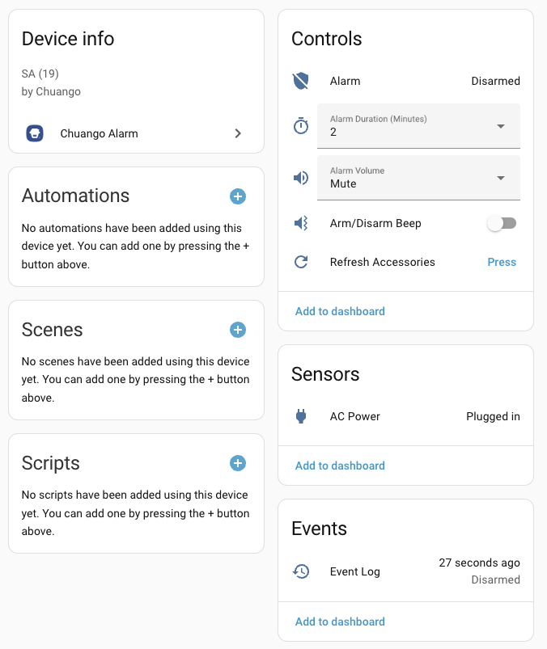
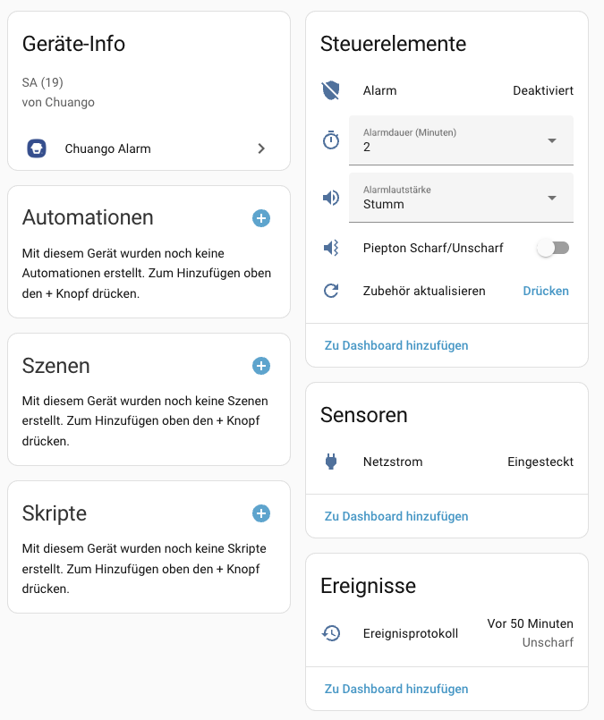

# Chuango Alarm

[![hacs][hacs-badge]][hacs-url]
[![release][release-badge]][release-url]
![downloads][downloads-badge]
![build][build-badge]
![license][license-badge]

<a href="https://www.buymeacoffee.com/nemon" target="_blank"></a>

**[English](#features)** | **[Deutsch](#chuango-alarm-deutsch)**

Home Assistant integration for **Chuango OV-300** WiFi alarm systems via the DreamCatcher Live cloud service.

## Features

- Arm, disarm, and home-arm your alarm system
- Real-time status updates
- Shows who changed the alarm state (user attribution)
- Alarm volume, duration, and arm/disarm beep configuration
- Accessories / sensor list (door, window, PIR, key fobs) as sub-devices
- Event log with alarm history
- Automatic accessory refresh every 24h + manual refresh button
- Diagnostic sensors (token expiration, device info)
- Multi-region support (EU, US, Asia, etc.)



## Supported Models

| Model | Status |
|-------|--------|
| [OV-300](https://chuango.de/en/products/smart-wifi-alarm-system-ov-300) | Tested |
| [LTE-400](https://chuango.de/en/products/wifi-4g-alarm-system-lte-400) | Untested |

## Testers Wanted

Testers for other Chuango WiFi alarm systems are wanted.  
If you use a different Chuango model, please open an issue and share your model name plus test results.

## Requirements

- A Chuango OV-300 alarm system
- An account in the **DreamCatcher Live** app ([Android](https://play.google.com/store/apps/details?id=com.dc.dreamcatcherlife) / [iOS](https://apps.apple.com/de/app/dreamcatcher-life/id1507718806))
- Home Assistant 2024.1 or newer

## Installation

### HACS (Recommended)

1. Open **HACS** in Home Assistant
2. Go to **Integrations** → **⋮** (three dots) → **Custom repositories**
3. Add `https://github.com/NemoN/ha-chuango-ov300` with category **Integration**
4. Search for **"Chuango Alarm"** and install it
5. Restart Home Assistant

**Or use this button:**

[](https://my.home-assistant.io/redirect/hacs_repository/?owner=NemoN&repository=ha-chuango-ov300)

### Manual Installation

1. Download the latest release from [GitHub](https://github.com/NemoN/ha-chuango-ov300/releases)
2. Extract and copy `custom_components/chuango_alarm` to your `config/custom_components/` directory
3. Restart Home Assistant

## Configuration

1. Go to **Settings** → **Devices & Services**
2. Click **+ Add Integration**
3. Search for **"Chuango Alarm"**
4. In the DreamCatcher app, create a dedicated user for Home Assistant (separate email address).
5. Share your alarm system with that dedicated user in the DreamCatcher app.
6. Enter that dedicated user's credentials in the integration:

| Field | Description | Example |
|-------|-------------|---------|
| Country | Your country/region | Germany |
| E-Mail | DreamCatcher Live email | user@example.com |
| Password | DreamCatcher Live password | ••••••••• |

[](https://my.home-assistant.io/redirect/config_flow_start/?domain=chuango_alarm)

## Entities

### Alarm Control Panel

| Entity | Description |
|--------|-------------|
| `alarm_control_panel.<device_name>_alarm` | Main alarm control |

**Supported States:**
- `disarmed` - System is disarmed
- `armed_away` - System is armed (away mode)
- `armed_home` - System is armed (home mode)
- `triggered` - Alarm is triggered

**Supported Actions:**
- Arm Away
- Arm Home
- Disarm
- Trigger

### Configuration Entities

| Entity | Type | Description |
|--------|------|-------------|
| `select.<device>_alarm_volume` | Select | Alarm volume (Mute / Low / Medium / High) |
| `select.<device>_alarm_duration` | Select | Alarm duration in minutes (1–5) |
| `switch.<device>_arm_disarm_beep` | Switch | Enable/disable arm/disarm beep tone |

### Accessories (Sub-Devices)

Accessories paired with the alarm panel are automatically discovered and appear as sub-devices:

| Entity | Type | Description |
|--------|------|-------------|
| `binary_sensor.<sensor_name>` | Binary Sensor | Door/window/PIR sensor (device class auto-detected) |
| `binary_sensor.<keyfob_name>` | Binary Sensor | Key fob / remote presence |

### Utility

| Entity | Type | Description |
|--------|------|-------------|
| `button.<device>_refresh_accessories` | Button | Manually refresh accessories list |

### Event Log

| Entity | Type | Description |
|--------|------|-------------|
| `event.<device>_event_log` | Event | Live alarm events (arm/disarm, SOS, tamper, power, sensor trigger) |

The event entity fires on every alarm event received via MQTT. Historical events from the cloud API are available in the entity's `history` attribute.

### Diagnostic Sensors

| Entity | Description |
|--------|-------------|
| `sensor.chuango_user` | Logged-in user info |
| `sensor.chuango_token_expiration` | Token validity timestamp |
| `sensor.<device>_device_type` | Device type identifier |
| `sensor.<device>_product_id` | Product ID |
| `sensor.<device>_device_id` | Device ID |

## Example Automations

### Notify on Alarm Trigger

```yaml
automation:
  - alias: "Alarm Triggered Notification"
    trigger:
      - platform: state
        entity_id: alarm_control_panel.ov300_alarm
        to: "triggered"
    action:
      - service: notify.mobile_app_phone
        data:
          title: "Alarm!"
          message: >-
            Alarm triggered by
            {{ state_attr('alarm_control_panel.ov300_alarm', 'triggered_by') }}
          data:
            priority: high
```

### Arm Alarm When Leaving Home

```yaml
automation:
  - alias: "Arm Alarm on Leave"
    trigger:
      - platform: state
        entity_id: person.your_name
        from: "home"
    action:
      - service: alarm_control_panel.alarm_arm_away
        target:
          entity_id: alarm_control_panel.ov300_alarm
```

### Disarm Alarm When Arriving Home

```yaml
automation:
  - alias: "Disarm Alarm on Arrival"
    trigger:
      - platform: state
        entity_id: person.your_name
        to: "home"
    action:
      - service: alarm_control_panel.alarm_disarm
        target:
          entity_id: alarm_control_panel.ov300_alarm
```

### Alarm History Dashboard Card

```yaml
type: markdown
title: Alarm History
content: >-
  
  
  
    
  {{ icons.get(e.type, '❓') }} **{{ e.time | timestamp_local('%H:%M:%S') }}** {{ e.name }}
    
  
  No entries
  
```

## Troubleshooting

| Error | Cause | Solution |
|-------|-------|----------|
| `Invalid login` | Wrong credentials | Check email and password in DreamCatcher Live app |
| `Connection failed` | Network issue | Check internet connection, try again later |
| `Invalid country selection` | Unknown region | Select a valid country from the list |
| `No shared devices found` | No alarm system shared with this account | Create a dedicated HA user in DreamCatcher app, share the alarm system with that user, then log in with this user in HA |
| `Already configured` | Duplicate setup | Remove existing integration first |

### Debug Logging

Add this to your `configuration.yaml` to enable debug logging:

```yaml
logger:
  default: info
  logs:
    custom_components.chuango_alarm: debug
```

## Known Limitations

- **Cloud-dependent**: Requires internet connection (no local control)
- **API rate limits**: Excessive requests may be throttled
- **Token refresh**: Token expires after ~30 days, auto-refreshed when < 12h remaining

## Hardware Info

### OV-300

- **SoC**: WinnerMicro W800
- **Documentation**: [W800 Developer Guide](https://doc.winnermicro.net/w800/en/latest/soc_guides/index.html)
- **Specification**: [W800 Spec V2.0](http://ask.winnermicro.com/uploads/20241203/62e2b1e36dd2355a064bd60636ff66ab.pdf)

## Changelog

### 0.4.1

- **Translations**: Added `strings.json` for proper translation support; entity names now correctly translate based on HA system language
- **Live event delivery**: Alarm events are now delivered immediately via HA dispatcher signals instead of coordinator updates, fixing missed or delayed events
- **Live event history**: Live MQTT alarm events are now appended to the history attribute in real-time
- **Screenshots**: Added device page screenshots (English & German) to README

### 0.4.0

- **Event log**: Live alarm events (arm/disarm, SOS, tamper, power, sensor trigger) as event entity with cloud history
- **AC power status**: Binary sensor showing mains/battery power state
- **Dashboard card**: Markdown card example for alarm history display

### 0.3.0

- **Alarm settings**: Configure alarm volume (mute/low/medium/high), alarm duration (1–5 min), and arm/disarm beep on/off
- **Accessories as sub-devices**: Door, window, PIR sensors and key fobs appear as sub-devices beneath the alarm panel
- **Refresh accessories**: Manual button to refresh the accessories list, plus automatic refresh every 24 hours
- **Triggered-by tracking**: Shows which sensor or user triggered the alarm (including SOS)
- **Improved shutdown**: Clean integration shutdown without errors

### 0.2.3

- Initial public release
- Alarm control panel (arm away, arm home, disarm)
- Real-time status updates
- User attribution (who changed the alarm state)
- Diagnostic sensors (user, token expiration, device info)
- Multi-region support

## Contributing

Contributions are welcome! Please:

1. Fork the repository
2. Create a feature branch
3. Submit a pull request

For bugs and feature requests, please [open an issue](https://github.com/NemoN/ha-chuango-ov300/issues).

## License

This project is licensed under the MIT License - see the [LICENSE](LICENSE) file for details.

## Credits

- **Author**: [@NemoN](https://github.com/NemoN)

---

# Chuango Alarm (Deutsch)

Home Assistant Integration für **Chuango OV-300** WLAN-Alarmanlagen über den DreamCatcher Live Cloud-Dienst.

## Funktionen

- Scharf-, Unscharf- und Zuhause-Schaltung der Alarmanlage
- Echtzeit-Statusaktualisierung
- Zeigt an, wer den Alarmzustand geändert hat
- Alarmlautstärke, Alarmdauer und Piepton-Einstellungen
- Zubehör / Sensorliste (Tür, Fenster, PIR, Schlüssel) als Untergeräte
- Ereignisprotokoll mit Alarm-Verlauf
- Automatische Zubehör-Aktualisierung alle 24h + manueller Aktualisierungsknopf
- Diagnosesensoren (Token-Ablauf, Geräteinformationen)
- Multi-Region-Unterstützung (EU, US, Asien, etc.)



## Unterstützte Modelle

| Modell | Status |
|--------|--------|
| [OV-300](https://chuango.de/products/smart-wifi-alarm-system-ov-300) | Getestet |
| [LTE-400](https://chuango.de/products/wifi-4g-alarm-system-lte-400) | Ungetestet |

## Tester Gesucht

Es werden Tester für weitere Chuango WLAN-Alarmanlagen gesucht.  
Wenn du ein anderes Chuango-Modell nutzt, erstelle bitte ein Issue mit Modellname und Testergebnissen.

## Voraussetzungen

- Eine Chuango OV-300 Alarmanlage
- Ein Konto in der **DreamCatcher Live** App ([Android](https://play.google.com/store/apps/details?id=com.dc.dreamcatcherlife) / [iOS](https://apps.apple.com/de/app/dreamcatcher-life/id1507718806))
- Home Assistant 2024.1 oder neuer

## Installation

### HACS (Empfohlen)

1. **HACS** in Home Assistant öffnen
2. Gehe zu **Integrationen** → **⋮** (drei Punkte) → **Benutzerdefinierte Repositories**
3. Füge `https://github.com/NemoN/ha-chuango-ov300` mit Kategorie **Integration** hinzu
4. Suche nach **"Chuango Alarm"** und installiere es
5. Home Assistant neu starten

**Oder nutze diesen Button:**

[](https://my.home-assistant.io/redirect/hacs_repository/?owner=NemoN&repository=ha-chuango-ov300)

### Manuelle Installation

1. Lade das neueste Release von [GitHub](https://github.com/NemoN/ha-chuango-ov300/releases) herunter
2. Entpacke und kopiere `custom_components/chuango_alarm` in dein `config/custom_components/` Verzeichnis
3. Home Assistant neu starten

## Konfiguration

1. Gehe zu **Einstellungen** → **Geräte & Dienste**
2. Klicke auf **+ Integration hinzufügen**
3. Suche nach **"Chuango Alarm"**
4. Lege in der DreamCatcher-App einen eigenen Benutzer für Home Assistant an (separate E-Mail-Adresse).
5. Gib diesem Benutzer in der DreamCatcher-App die Alarmanlage frei.
6. Melde die Integration in Home Assistant mit diesem extra Benutzer an:

| Feld | Beschreibung | Beispiel |
|------|--------------|----------|
| Land | Dein Land/Region | Germany |
| E-Mail | DreamCatcher Live E-Mail | benutzer@beispiel.de |
| Passwort | DreamCatcher Live Passwort | ••••••••• |

[](https://my.home-assistant.io/redirect/config_flow_start/?domain=chuango_alarm)

## Entitäten

### Alarm-Zentrale

| Entität | Beschreibung |
|---------|--------------|
| `alarm_control_panel.<gerätename>_alarm` | Haupt-Alarmsteuerung |

**Unterstützte Zustände:**
- `disarmed` - System ist unscharf
- `armed_away` - System ist scharf (Abwesend-Modus)
- `armed_home` - System ist scharf (Zuhause-Modus)
- `triggered` - Alarm wurde ausgelöst

**Unterstützte Aktionen:**
- Scharf schalten (Abwesend)
- Scharf schalten (Zuhause)
- Unscharf schalten
- Alarm auslösen

### Sensoren

| Entität | Beschreibung |
|---------|--------------|
| `sensor.chuango_user` | Angemeldeter Benutzer |
| `sensor.chuango_token_expiration` | Token-Gültigkeitszeitstempel |
| `sensor.<gerät>_device_type` | Gerätetyp |
| `sensor.<gerät>_product_id` | Produkt-ID |
| `sensor.<gerät>_device_id` | Geräte-ID |

## Beispiel-Automatisierungen

### Benachrichtigung bei Alarm

```yaml
automation:
  - alias: "Alarm ausgelöst Benachrichtigung"
    trigger:
      - platform: state
        entity_id: alarm_control_panel.ov300_alarm
        to: "triggered"
    action:
      - service: notify.mobile_app_handy
        data:
          title: "Alarm!"
          message: >-
            Alarm ausgelöst durch
            {{ state_attr('alarm_control_panel.ov300_alarm', 'triggered_by') }}
          data:
            priority: high
```

### Alarm scharf schalten beim Verlassen

```yaml
automation:
  - alias: "Alarm scharf beim Verlassen"
    trigger:
      - platform: state
        entity_id: person.dein_name
        from: "home"
    action:
      - service: alarm_control_panel.alarm_arm_away
        target:
          entity_id: alarm_control_panel.ov300_alarm
```

### Alarm unscharf schalten bei Ankunft

```yaml
automation:
  - alias: "Alarm unscharf bei Ankunft"
    trigger:
      - platform: state
        entity_id: person.dein_name
        to: "home"
    action:
      - service: alarm_control_panel.alarm_disarm
        target:
          entity_id: alarm_control_panel.ov300_alarm
```

### Alarm-Verlauf Dashboard-Karte

```yaml
type: markdown
title: Alarm-Verlauf
content: >-
  
  
  
    
  {{ icons.get(e.type, '❓') }} **{{ e.time | timestamp_local('%H:%M:%S') }}** {{ e.name }}
    
  
  Keine Einträge
  
```

## Fehlerbehebung

| Fehler | Ursache | Lösung |
|--------|---------|--------|
| `Invalid login` | Falsche Anmeldedaten | E-Mail und Passwort in der DreamCatcher Live App prüfen |
| `Connection failed` | Netzwerkproblem | Internetverbindung prüfen, später erneut versuchen |
| `Invalid country selection` | Unbekannte Region | Ein gültiges Land aus der Liste wählen |
| `No shared devices found` | Für diesen Account wurde keine Alarmanlage freigegeben | In der DreamCatcher-App einen separaten HA-Benutzer anlegen, Anlage für diesen Benutzer freigeben und mit diesem Benutzer in HA anmelden |
| `Already configured` | Doppelte Einrichtung | Bestehende Integration zuerst entfernen |

### Debug-Logging

Füge dies zu deiner `configuration.yaml` hinzu, um Debug-Logging zu aktivieren:

```yaml
logger:
  default: info
  logs:
    custom_components.chuango_alarm: debug
```

## Bekannte Einschränkungen

- **Cloud-abhängig**: Erfordert Internetverbindung (keine lokale Steuerung)
- **API-Ratenlimits**: Übermäßige Anfragen können gedrosselt werden
- **Token-Aktualisierung**: Token läuft nach ~30 Tagen ab, wird automatisch erneuert wenn < 12h verbleibend

## Hardware-Info

### OV-300

- **SoC**: WinnerMicro W800
- **Dokumentation**: [W800 Developer Guide](https://doc.winnermicro.net/w800/en/latest/soc_guides/index.html)
- **Spezifikation**: [W800 Spec V2.0](http://ask.winnermicro.com/uploads/20241203/62e2b1e36dd2355a064bd60636ff66ab.pdf)

## Änderungsprotokoll

### 0.4.1

- **Übersetzungen**: `strings.json` für korrektes Übersetzungssystem hinzugefügt; Entity-Namen werden nun korrekt anhand der HA-Systemsprache übersetzt
- **Live-Event-Zustellung**: Alarm-Events werden jetzt sofort per HA-Dispatcher-Signal ausgeliefert statt über Coordinator-Updates, wodurch fehlende oder verzögerte Events behoben werden
- **Live-Event-Historie**: Live-MQTT-Alarm-Events werden nun in Echtzeit in das History-Attribut geschrieben
- **Screenshots**: Geräteseiten-Screenshots (Englisch & Deutsch) zur README hinzugefügt

### 0.4.0

- **Ereignisprotokoll**: Live-Alarm-Events (Scharf/Unscharf, SOS, Manipulation, Strom, Sensor) als Event-Entität mit Cloud-Historie
- **Netzstrom-Status**: Binary Sensor zeigt Netz-/Batteriebetrieb an
- **Dashboard-Karte**: Markdown-Karte für die Alarm-Verlaufsanzeige

### 0.3.0

- **Alarm-Einstellungen**: Alarmlautstärke (Stumm/Niedrig/Mittel/Laut), Alarmdauer (1–5 Min.) und Piepton Scharf/Unscharf konfigurierbar
- **Zubehör als Untergeräte**: Tür-, Fenster-, PIR-Sensoren und Schlüssel erscheinen als Untergeräte unter der Alarmanlage
- **Zubehör aktualisieren**: Manueller Button zum Aktualisieren der Zubehörliste, plus automatische Aktualisierung alle 24 Stunden
- **Auslöser-Nachverfolgung**: Zeigt an, welcher Sensor oder Benutzer den Alarm ausgelöst hat (inkl. SOS)
- **Verbesserter Shutdown**: Sauberes Beenden der Integration ohne Fehlermeldungen

### 0.2.3

- Erste öffentliche Veröffentlichung
- Alarm-Zentrale (Scharf Abwesend, Scharf Zuhause, Unscharf)
- Echtzeit-Statusaktualisierung
- Benutzer-Zuordnung (wer hat den Alarmzustand geändert)
- Diagnosesensoren (Benutzer, Token-Ablauf, Geräteinfo)
- Multi-Region-Unterstützung

## Mitwirken

Beiträge sind willkommen! Bitte:

1. Forke das Repository
2. Erstelle einen Feature-Branch
3. Reiche einen Pull Request ein

Für Fehler und Feature-Anfragen bitte ein [Issue erstellen](https://github.com/NemoN/ha-chuango-ov300/issues).

<!-- Badges -->

[hacs-badge]: https://img.shields.io/badge/hacs-default-orange.svg?style=flat-square
[release-badge]: https://img.shields.io/github/v/release/NemoN/ha-chuango-ov300?style=flat-square
[downloads-badge]: https://img.shields.io/github/downloads/NemoN/ha-chuango-ov300/total?style=flat-square
[build-badge]: https://img.shields.io/github/actions/workflow/status/NemoN/ha-chuango-ov300/hassfest.yml?branch=main&style=flat-square
[license-badge]: https://img.shields.io/github/license/NemoN/ha-chuango-ov300

<!-- References -->

[hacs]: https://hacs.xyz
[hacs-url]: https://github.com/hacs/integration
[release-url]: https://github.com/NemoN/ha-chuango-ov300/releases